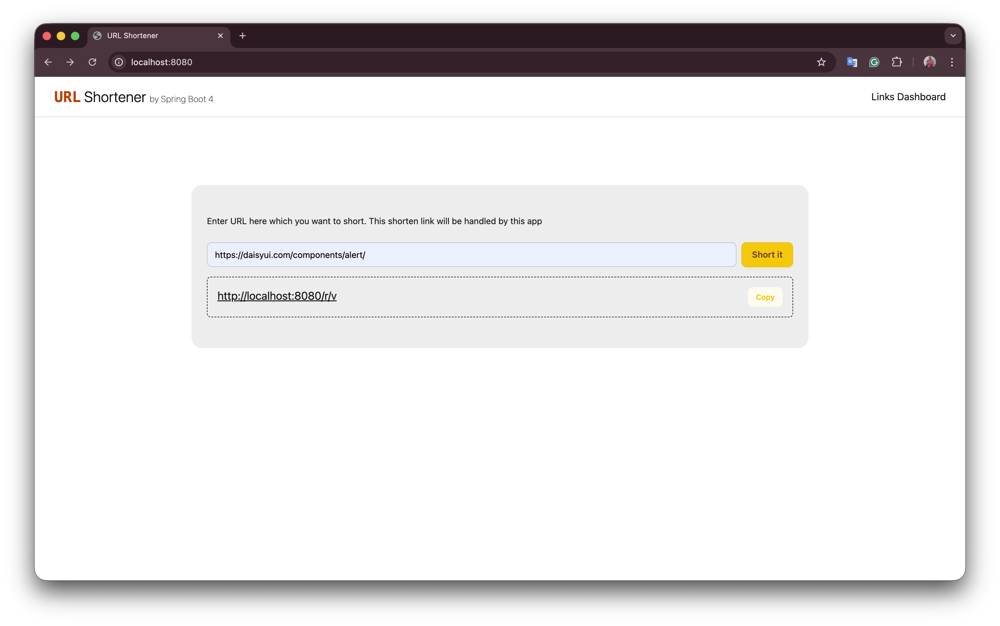
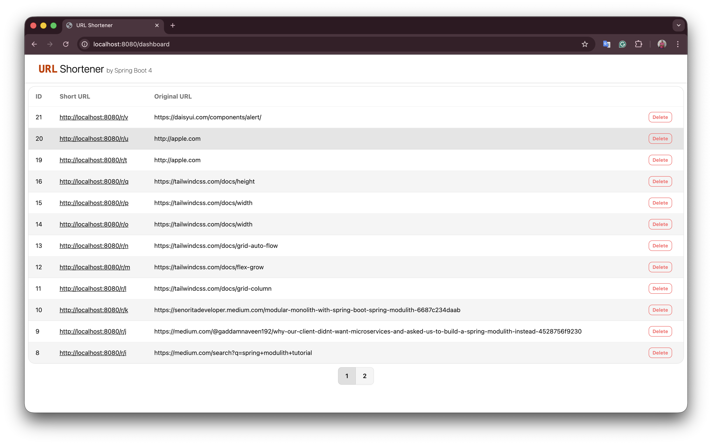

# URL Shortener

----

This is a simple URL Shortener application built with Java web technologies and tools

Current implementation based on following frameworks and tools:
- **Java 25**
- **Spring Boot 4**
- **Spring Data**
- **JTE (Java Template Engine)**
- **HTMX**
- **Thymeleaf CSS and Daisy UI**
- **Hexagonal Architecture approach**
- **PostgreSQL**
- **Redis**
- **Docker**

### App screenshots

